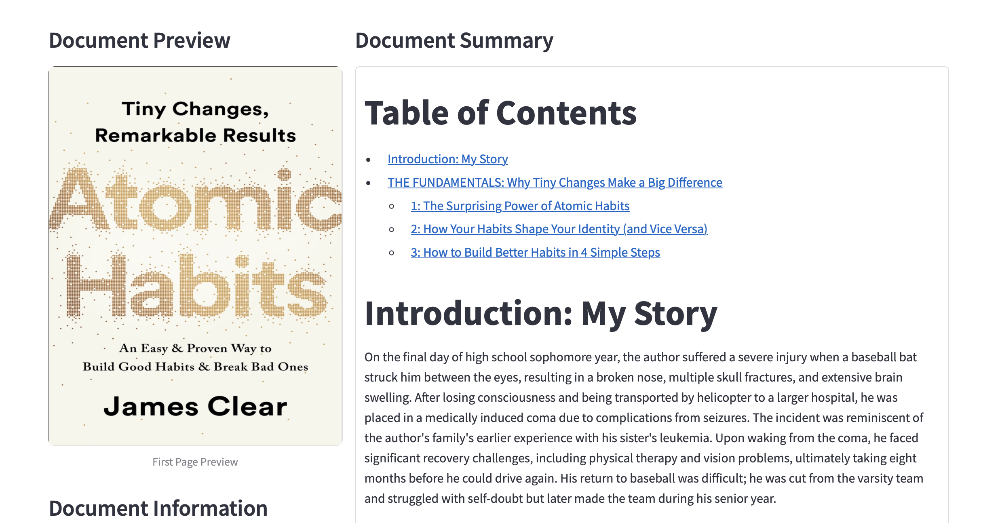

# About the Application
The application enables users to upload their own PDF books and automatically generate high-quality summaries and insights from the original text, helping them quickly extract key information and value from their reading material.



# Installation Guidline

## Clone this project
To clone this project, run:
```
git clone https://github.com/HaiNguyen2903/LLM-Book-Summary
```

Move to the repo folder:
```
cd LLM-Book-Summary
```

## Create a conda environment:
```
conda create -n {your environment}
```

## Activate the created environment:
```
conda activate {your environment}
```

## Install neccessary packages:
```
pip install -r requirements.txt
```

## Export API key to local environment
In order to use OpenAI API key, activate your virtual enviroment and run the following script:
```
export OPENAI_API_KEY="YOUR_API_KEY"
```

# Usage Guidline
In order to run the main app, run:
```
streamlit run app.py
```

In order to convert a summary file to speech, run
```
python text_to_speech.py {your_summary_path (.md or .txt format)}
```