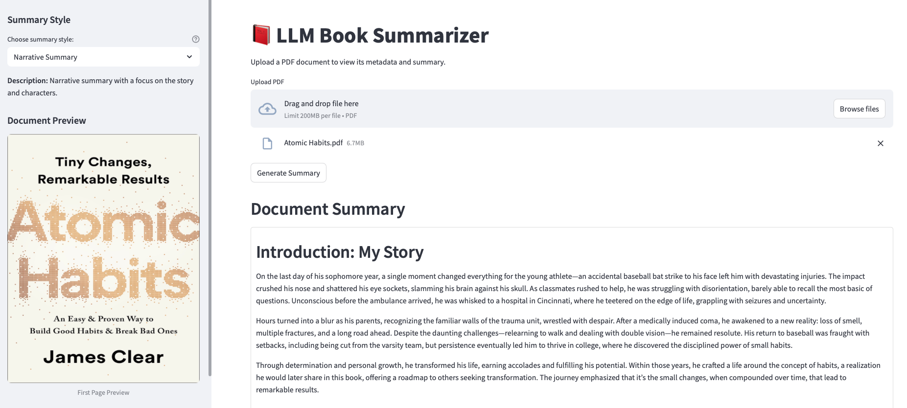
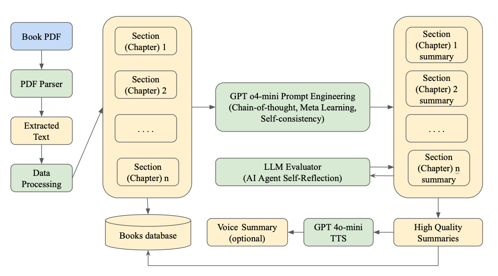
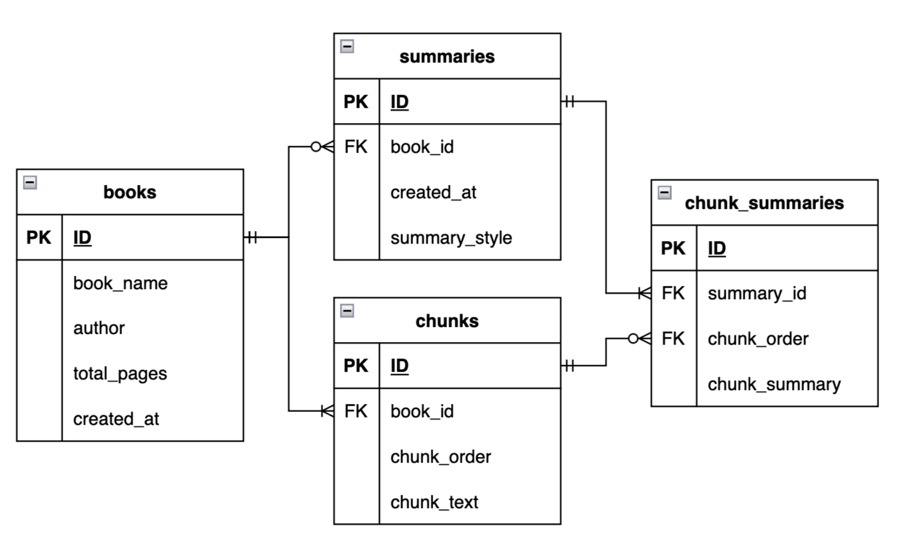
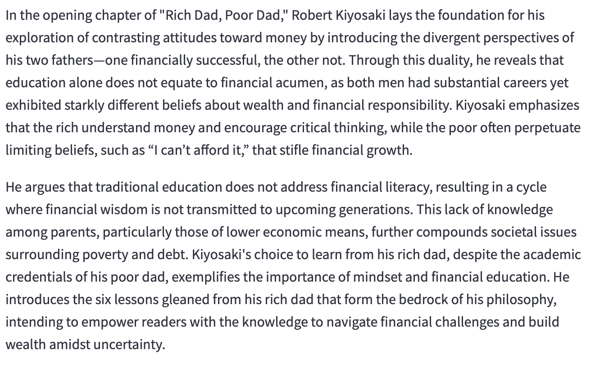
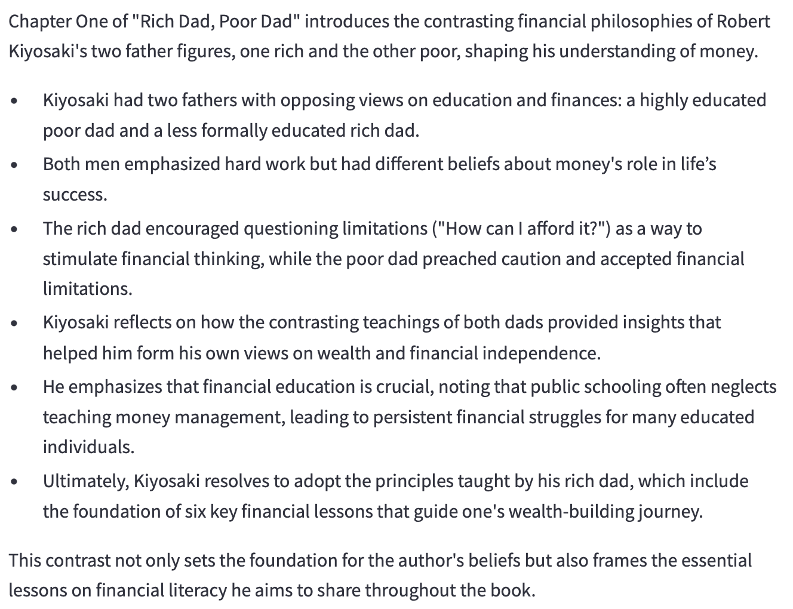
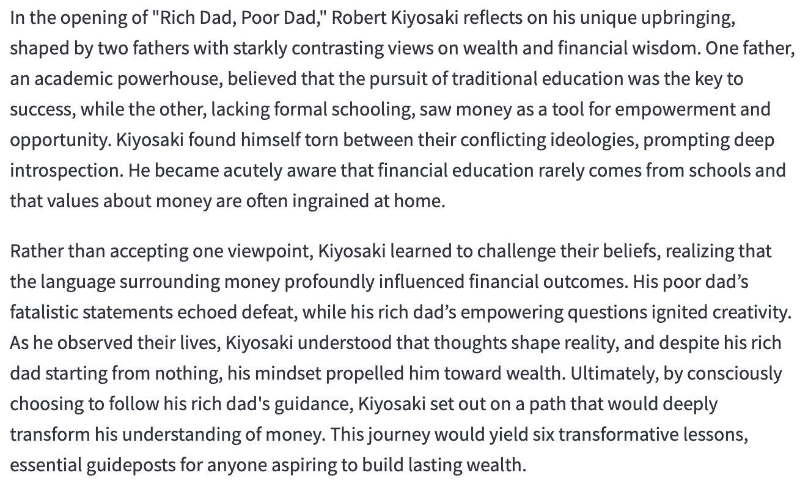
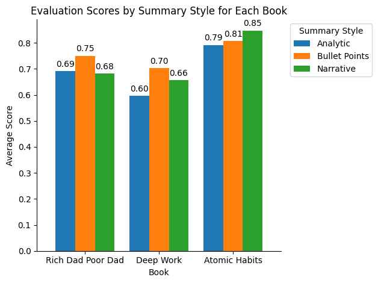
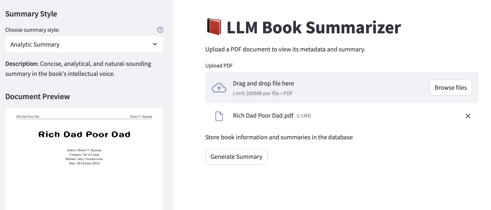

# About the Application
The application enables users to upload their PDF books and effortlessly generate high-quality summaries and insights from the original text, making it easy to quickly grasp key information and value from their reading materials. Additionally, a text-to-speech feature has been integrated to help users consume their content more conveniently.

The app offers various summary styles to cater to different needs:

- **Analytic Summary**: A concise, analytical summary that captures the book's intellectual tone in a natural way.
- **Bullet-Points Summary**: A clear, scannable bullet-point format for quick and easy reference.
- **Narrative Summary**: A story-focused summary that highlights the narrative and characters.

Users can also download their summarized content for offline access, ensuring they can save and revisit their reading materials anytime.

<!--  -->

<style>
  figcaption {
    text-align: center;
  }
</style>

<figure>
  
  <figcaption>Application Demonstration</figcaption>
</figure>

# System Architecture

## Workflow
- The book summarizer employs a modular, scalable, and user-focused architecture optimized for the efficient processing of extensive volumes. Designed as a pipeline, each module performs a distinct function, beginning with the PDF Parsing Module, which extracts structured text from uploaded files while maintaining chapter and section formatting.

- The Chunking and Preprocessing Module divides content into digestible segments according to the table of contents or headers. This design facilitates the management of token restrictions in LLMs and guarantees uniform, constrained inputs for summarization.

- The LLM Summarization Engine uses Chain-of-Thought prompting, meta-learning, and self-consistency loops to produce high-quality summaries from segmented text. An integrated AI-driven Evaluation Module assesses factual accuracy and content comprehensiveness, enhancing precision and minimizing hallucinations via iterative feedback.

- A Streamlit-based interface enables users to upload PDFs and choose from various summary formats—analytical, bullet-point, or narrative. The system additionally offers optional voice summaries with GPT-4o-mini's text-to-speech functionality. The architecture is designed with platform-agnostic flexibility, facilitating future LLM improvements and ensuring compatibility. All data is processed locally or inside secure settings to ensure user privacy. This stratified framework improves stability, adaptation, and long-term sustainability.


<figure>
  
  <figcaption>Application workflow</figcaption>
</figure>


## Database Design

- Simple, private, and efficient are summarizer database design priorities. It stores metadata such as file titles, upload times, and summary settings instead of full documents, decreasing storage and data exposure.
- SQLite3 was chosen for its lightweight, zero-setup architecture and excellent structured data handling. The system is scalable, privacy-preserving, and easy to prototype and maintain due to local deployment.
- The schema has four primary tables: books (metadata), chunks (token-limited text segments), summaries (styled summary outputs), and chunk_summaries. This architecture allows fine-grained evaluation, style customization, and multi-language expansion for long-term usability.

<figure>
  
  <figcaption>Database design</figcaption>
</figure>

# Result Demonstrations
Here, we will summary the first chapter of the **"Rich Dad, Poor Dad"** book to see the difference between 3 summary styles.

The images reveal that analytic summaries employ formal, in-depth analysis with technical vocabulary, bullet point summaries use concise, direct language in a list format for quick reference, and narrative summaries adopt descriptive, storytelling prose to engage readers, each distinctly shaping the vocabulary and structure of the summaries.

<figure>
  
  <figcaption>Analytic Summary</figcaption>
</figure>

<figure>
  
  <figcaption>Bullet-points Summary</figcaption>
</figure>

<figure>
  
  <figcaption>Narrative Summary</figcaption>
</figure>

## Evaluation
[DeepEval framework](https://www.deepeval.com) with CustomMetric was leveraged to evaluate the summary qualities. 2 crucial metrics were calculated:

- **Alignment Score**: For alignment, the evaluator LLM generates a list of claims from the summary, and for each claim, the LLM will determine how many of these claims are supported by truths which are extracted from the source text

- **Coverage Score**: The LLM generates a list of assessment questions from the source text, then tries to answer the questions, using only the summary as context. The LLM is prompted to respond ‘idk’ if the answer cannot be found. Then, the LLM will determine how many of these answers are correct, to get the coverage score.

However, the limitations of DeepEval default approachs to calculate these metrics were highlighted in this [Medium blog](https://medium.com/data-science/how-to-evaluate-llm-summarization-18a040c3905d). This project re-implemented the new evaluation approachs proposed by the author to mitigate the existing issues.

The Final Score is given by $\text{Final Score} = \frac{\text{Alignment Score} \cdot \text{Coverage Score}}{\text{Alignment Score} + \text{Coverage Score}}$.

<figure>
  
  <figcaption>Evaluation Score on 3 different books</figcaption>
</figure>

The data indicates that narrative summaries achieved the highest overall performance, exemplified by a score of 0.85 for "Atomic Habits," attributed to their inherent fluidity and storytelling quality. Analytical summaries provided exact alignment and were optimal for concept-dense literature, but bullet-point summaries enhanced clarity and comprehensiveness for rapid reading.


# Installation Guidline

## Clone this project
To clone this project, run:
```
git clone https://github.com/HaiNguyen2903/LLM-Book-Summary
```

Move to the repo folder:
```
cd LLM-Book-Summary
```

## Create a conda environment:
```
conda create -n {your environment}
```

## Activate the created environment:
```
conda activate {your environment}
```

## Install neccessary packages:
```
pip install -r requirements.txt
```

## Export API key to local environment
In order to use OpenAI API key, activate your virtual enviroment and run the following script:
```
export OPENAI_API_KEY="YOUR_API_KEY"
```

# Usage Guidline

## Streamlit app
In order to run the main app, run:
```
streamlit run app.py
```

The app allows users to upload pdf file, select appropriate summary style and download the content after finishing.

<figure>
  
  <figcaption>Demo App Features</figcaption>
</figure>

## Text to speech
In order to convert a summary file to speech, run
```
python text_to_speech.py {your_summary_path (.md or .txt format)}
```